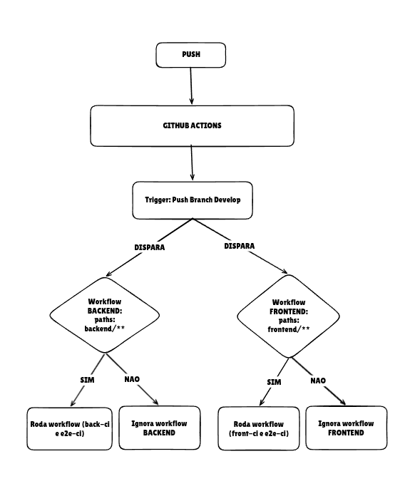

# Cobaia - Aplicando pipelines CI/CD

A ideia é estudar e gerar cenários de aplicação de conceitos CI/CD a partir de um projeto Cobaia (React e Fastify).

## Contexto
A ideia é simular um cenário onde um monorepositório (repositório com vários projetos), nesse caso backend e frontend, passem por um pipeline gradual de CI/CD.

## Como Funciona:

### Front
Toda vez que é feito o push na branch `develop`, mais precisamente no diretório `frontend`, o workflow `front-ci` é executado gerando:
* Verificação do código
* Instalação do Node e dependências do projeto
* Build

### Backend:
Toda vez que é feito o push na branch `develop`, mais precisamente no diretório `backend`, o workflow `back-ci` é executado gerando:
* Verificação do código
* Instalação do Node e dependências do projeto
* Build
 

### Testes E2E:
Toda vez que é feito o push na branch `develop`, desta vez tanto no diretório `frontend` quanto `backend`, o workflow `e2e-ci` é executado gerando:
* Verificação do código
* Instalação do Node e dependências do projeto do backend
* Subida do servidor em modo espera (para não dar erro no teste)
* Instalação das dependências do frontend
* Execução dos testes

## CD (Continuous Delivery)

### Frontend (S3 + CloudFront):
Toda vez que é feito o push na branch `develop`, no diretório `frontend`, o workflow `front-cd` é executado gerando:
* Verificação do código
* Instalação do Node e dependências
* Build (com variável `VITE_API_URL` injetada)
* Sync dos arquivos para o **S3**
* Invalidação do cache do **CloudFront**

### Backend (Docker + ECR + EC2):
Toda vez que é feito o push na branch `develop`, no diretório `backend`, o workflow `back-cd` é executado gerando:
* Verificação do código
* Login no **ECR** (Elastic Container Registry)
* Build da imagem Docker e push para o ECR
* Conexão SSH na **EC2 t3.micro**
* Pull da nova imagem e restart do container

### Secrets necessários no GitHub:
| Secret | Descrição |
|--------|-----------|
| `AWS_ACCESS_KEY_ID` | Chave de acesso IAM |
| `AWS_SECRET_ACCESS_KEY` | Chave secreta IAM |
| `AWS_REGION` | Região AWS (ex: `us-east-1`) |
| `ECR_REPOSITORY` | URI do repositório ECR |
| `EC2_HOST` | IP público ou DNS da EC2 |
| `EC2_SSH_KEY` | Chave privada SSH (PEM) |
| `S3_BUCKET` | Nome do bucket S3 |
| `CLOUDFRONT_DISTRIBUTION_ID` | ID da distribuição CloudFront |
| `VITE_API_URL` | URL pública do backend (ex: `http://ec2-xxx.compute.amazonaws.com:3000`) |

## Fluxo
